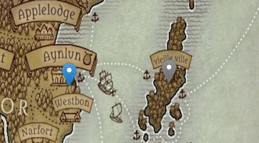

# Interactive DnD Map
> An interactive DnD Map for my party that allows them to bring life and history to the map as we play.

## About

This project was made to create a interactive map for my group of friends i play DnD with. It combines a JavaScript library called [Leaflet](https://leafletjs.com/) with a easy to read/write json database. It will mainly be used and edited by my party but others may clone the project to suit their needs.

[See the map in action here:](https://lukedev820.github.io/Interactive-DnD-Map/)

## Installation

Clone the repository 

    git clone https://github.com/lukedev820/Interactive-DnD-Map
Run the `index.html` on a live server. 

## Configuration
 - Markers can be added to your map within the `spotsData.json` (See [Adding markers](#adding-markers-dnd-group-only) for the marker template.
 - Map setup and JSON marker generator are located in `main.js`
 - Marker icon configurations can be found markers.js
 - Icon files are located in `icons/`
## Contributing
Although adding new markers to the main map is strictly for the D&D Group using it. If you think the code can be improved or fixed feel free to send a PR with your changes.

## License
[BSD-2-Clause license](LICENSE)

## Acknowledgments

 - [zeldabotwstreetview](https://github.com/nassimsoftware/zeldabotwstreetview) and ["Creating an Interactive World Map: With Leaflet.js" by Sam Brooks](https://techtrail.net/creating-an-interactive-map-with-leaflet-js/) for the inspiration for this project
 - [leaflet-color-markers](https://github.com/pointhi/leaflet-color-markers) for the coloured  markers used
 - My DM for his permisson to use his map for this project.

